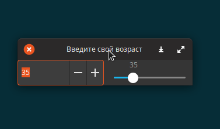
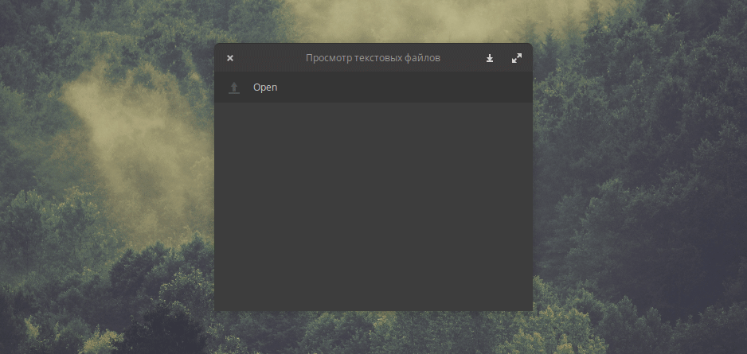

# Базовые GTK программы

## Окно с кнопкой

Этот пример демонстрирует, как создать окно верхнего уровня, установить его заголовок, размер и положение, как добавить кнопку в это окно и как связать сигналы с действиями.

```csharp
using Gtk;

int main (string[] args) {
    Gtk.init (ref args);

    var window = new Window ();
    window.title = "Первая GTK программа";
    window.border_width = 10;
    window.window_position = WindowPosition.CENTER;
    window.set_default_size (350, 70);
    window.destroy.connect (Gtk.main_quit);

    var button = new Button.with_label ("Нажми меня!");
    button.clicked.connect (() => {
        button.label = "Спасибо!";
    });

    window.add (button);
    window.show_all ();

    Gtk.main ();
    return 0;
}
```

Все классы GTK находятся внутри пространства имен _Gtk_ . Вы должны инициализировать каждую программу GTK с помощью _Gtk.init \(\)_. 


Конечно при небольшом количестве подключенных пространств имен можно писать и просто init\(\) без Gtk.


#### Скомпилируйте и запустите <a id="Compile_and_Run"></a>

```text
$ valac --pkg gtk+-3.0 gtk-hello.vala
$ ./gtk-hello
```


### Настройка иконки приложения <a id="Setting_an_Application_Icon"></a>

```csharp
try {
    // Либо прямо из файла ...
    window.icon = new Gdk.Pixbuf.from_file ("my-app.png");
    // ... или из темы
    window.icon = IconTheme.get_default ().load_icon ("my-app", 48, 0);
} catch (Error e) {
    stderr.printf (@"Не удалось загрузить значок приложения: $(e.message)");
}
```


### Синхронизация виджетов <a id="Synchronizing_Widgets"></a>

Вы можете использовать сигналы чтобы синхронизировать значения виджетов. В этом примере ползунок и счетчик будут взаимосвязаны.

```csharp
using Gtk;

public class SyncSample : Window {

    private SpinButton spin_box;
    private Scale slider;

    public SyncSample () {
        this.title = "Введите свой возраст";
        this.window_position = WindowPosition.CENTER;
        this.destroy.connect (Gtk.main_quit);
        set_default_size (300, 20);

        spin_box = new SpinButton.with_range (0, 130, 1);
        slider = new Scale.with_range (Orientation.HORIZONTAL, 0, 130, 1);
        spin_box.adjustment.value_changed.connect (() => {
            slider.adjustment.value = spin_box.adjustment.value;
        });
        slider.adjustment.value_changed.connect (() => {
            spin_box.adjustment.value = slider.adjustment.value;
        });
        spin_box.adjustment.value = 35;

        var hbox = new Box (Orientation.HORIZONTAL, 5);
        hbox.homogeneous = true;
        hbox.add (spin_box);
        hbox.add (slider);
        add (hbox);
    }

    public static int main (string[] args) {
        Gtk.init (ref args);

        var window = new SyncSample ();
        window.show_all ();

        Gtk.main ();
        return 0;
    }
}
```



### Панель инструментов, скроллинг текста и выбор файла <a id="Toolbar.2C_Scrollable_Text_View_and_File_Chooser"></a>

#### Простой просмотрщик текстовых файлов:

```csharp
using Gtk;

public class TextFileViewer : Window {

    private TextView text_view;

    public TextFileViewer () {
        this.title = "Просмотр текстовых файлов";
        this.window_position = WindowPosition.CENTER;
        set_default_size (400, 300);

        var toolbar = new Toolbar ();
        toolbar.get_style_context ().add_class (STYLE_CLASS_PRIMARY_TOOLBAR);

        var open_icon = new Gtk.Image.from_icon_name ("document-open", 
            IconSize.SMALL_TOOLBAR);
        var open_button = new Gtk.ToolButton (open_icon, "Open");
        open_button.is_important = true;
        toolbar.add (open_button);
        open_button.clicked.connect (on_open_clicked);

        this.text_view = new TextView ();
        this.text_view.editable = false;
        this.text_view.cursor_visible = false;

        var scroll = new ScrolledWindow (null, null);
        scroll.set_policy (PolicyType.AUTOMATIC, PolicyType.AUTOMATIC);
        scroll.add (this.text_view);

        var vbox = new Box (Orientation.VERTICAL, 0);
        vbox.pack_start (toolbar, false, true, 0);
        vbox.pack_start (scroll, true, true, 0);
        add (vbox);
    }

    private void on_open_clicked () {
        var file_chooser = new FileChooserDialog ("Open File", this,
                                      FileChooserAction.OPEN,
                                      "_Cancel", ResponseType.CANCEL,
                                      "_Open", ResponseType.ACCEPT);
        if (file_chooser.run () == ResponseType.ACCEPT) {
            open_file (file_chooser.get_filename ());
        }
        file_chooser.destroy ();
    }

    private void open_file (string filename) {
        try {
            string text;
            FileUtils.get_contents (filename, out text);
            this.text_view.buffer.text = text;
        } catch (Error e) {
            stderr.printf ("Ошибка: %s\n", e.message);
        }
    }

    public static int main (string[] args) {
        Gtk.init (ref args);

        var window = new TextFileViewer ();
        window.destroy.connect (Gtk.main_quit);
        window.show_all ();

        Gtk.main ();
        return 0;
    }
}
```



Если вы хотите добавить дополнительные функции или изменить поведение диалога, вы можете _создать_ подкласс _FileChooserDialog_. Например этот запоминает последнюю папку:

```csharp
using Gtk;

public class OpenFileDialog : FileChooserDialog {

    private string last_folder;

    public OpenFileDialog () {
        this.title = "Open File";
        this.action = FileChooserAction.OPEN;

        add_button (Stock.CANCEL, ResponseType.CANCEL);
        add_button (Stock.OPEN, ResponseType.ACCEPT);
        set_default_response (ResponseType.ACCEPT);

        if (this.last_folder != null) {
            set_current_folder (this.last_folder);
        }
    }

    public override void response (int type) {
        if (type == ResponseType.ACCEPT) {
            this.last_folder = get_current_folder ();
        }
    }

    public static void main (string[] args) {
        Gtk.init (ref args);

        var ofd = new OpenFileDialog ();

        if (ofd.run () == ResponseType.OK) {
            stdout.printf ("filename = %s\n".printf (ofd.get_filename ()));
        }
    }
}
```

## Создание своего диалогового окна

Этот пример демонстрирует, как создать свой диалог, наследуясь от _Dialog_.

```csharp
using Gtk;

public class SearchDialog : Dialog {

    private Entry search_entry;
    private CheckButton match_case;
    private CheckButton find_backwards;
    private Widget find_button;

    public signal void find_next (string text, bool case_sensitivity);
    public signal void find_previous (string text, bool case_sensitivity);

    public SearchDialog () {
        this.title = "Find";
        this.border_width = 5;
        set_default_size (350, 100);
        create_widgets ();
        connect_signals ();
    }

    private void create_widgets () {

        // Create and setup widgets
        this.search_entry = new Entry ();
        var search_label = new Label.with_mnemonic ("_Search for:");
        search_label.mnemonic_widget = this.search_entry;
        this.match_case = new CheckButton.with_mnemonic ("_Match case");
        this.find_backwards = new CheckButton.with_mnemonic ("Find _backwards");

        // Layout widgets
        var hbox = new Box (Orientation.HORIZONTAL, 20);
        hbox.pack_start (search_label, false, true, 0);
        hbox.pack_start (this.search_entry, true, true, 0);
        var content = get_content_area () as Box;
        content.pack_start (hbox, false, true, 0);
        content.pack_start (this.match_case, false, true, 0);
        content.pack_start (this.find_backwards, false, true, 0);
        content.spacing = 10;

        // Add buttons to button area at the bottom
        add_button (Stock.HELP, ResponseType.HELP);
        add_button (Stock.CLOSE, ResponseType.CLOSE);
        this.find_button = add_button (Stock.FIND, ResponseType.APPLY);
        this.find_button.sensitive = false;

        show_all ();
    }

    private void connect_signals () {
        this.search_entry.changed.connect (() => {
            this.find_button.sensitive = (this.search_entry.text != "");
        });
        this.response.connect (on_response);
    }

    private void on_response (Dialog source, int response_id) {
        switch (response_id) {
        case ResponseType.HELP:
            // show_help ();
            break;
        case ResponseType.APPLY:
            on_find_clicked ();
            break;
        case ResponseType.CLOSE:
            destroy ();
            break;
        }
    }

    private void on_find_clicked () {
        string text = this.search_entry.text;
        bool cs = this.match_case.active;
        if (this.find_backwards.active) {
            find_previous (text, cs);
        } else {
            find_next (text, cs);
        }
    }
}

int main (string[] args) {
    Gtk.init (ref args);
    var dialog = new SearchDialog ();
    dialog.destroy.connect (Gtk.main_quit);
    dialog.show ();
    Gtk.main ();
    return 0;
}
```



Своё кастомное диалоговое окно гораздо проще создать не из кода а из Glade



### Загрузка пользовательского интерфейса из файла XML <a id="Loading_User_Interface_from_XML_File"></a>

Вместо ручного кодирования пользовательского интерфейса вашего приложения вы можете создать его с помощью удобного конструктора пользовательского интерфейса, такого как [Glade,](http://glade.gnome.org/) и сохранить его в виде файла XML. Ваше приложение может загрузить пользовательский интерфейс из этого файла во время выполнения с помощью класса _Gtk.Builder_ . Он может даже подключить все сигналы к их методам, если вы объявили их в Glade. Вот пример файла пользовательского интерфейса: [sample.ui](https://wiki.gnome.org/Projects/Vala/GTKSample?action=AttachFile&do=view&target=sample.ui)

Этот пример кода работает с файлом UI, связанным выше:

```csharp
using Gtk;

public void on_button1_clicked (Button source) {
    source.label = "Thank you!";
}

public void on_button2_clicked (Button source) {
    source.label = "Thanks!";
}

int main (string[] args) {
    Gtk.init (ref args);

    try {
        // Если UI содержит кастомные виджеты,они должны хотя бы один раз проинициализированы
        // Type type = typeof(Foo.BarEntry);
        // assert(type != 0);
        var builder = new Builder ();
        builder.add_from_file ("sample.ui");
        builder.connect_signals (null);
        var window = builder.get_object ("window") as Window;
        window.show_all ();
        Gtk.main ();
    } catch (Error e) {
        stderr.printf ("Не получилось загрузить UI: %s\n", e.message);
        return 1;
    }

    return 0;
}
```


## Подключение сигналов

...

