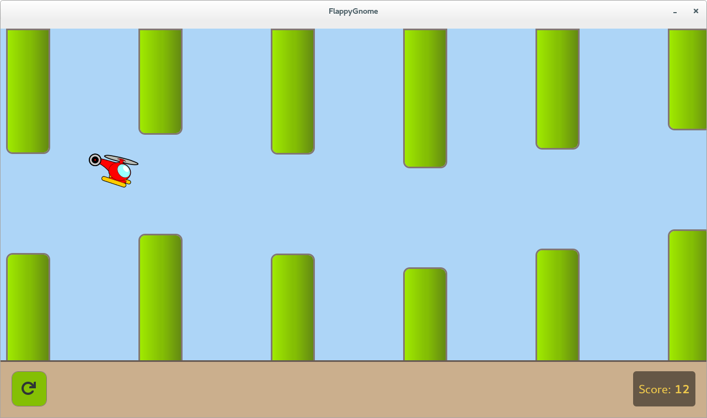

# Flappy Bird\(???\)



Flappy GNOME - руководство по разработке игр с боковой прокруткой, использующее Vala и GTK +.

Финальным результатом урока является мини-игра в стиле Flappy Bird.

Шаги учебника должны быть простыми, каждый шаг должен быть одним коммитом с минимальным необходимым различием. Кроме того, код довольно хорошо прокомментирован, короток и организован, поэтому его должно быть легко читать. Я осознаю тот факт, что GTK + не является фреймворком для разработки игр, не предназначен для этой цели, однако для простых игр его поддержки должно быть достаточно.


#### 1. Базовый интерфейс игры

* главное окно
* окно прокрутки для боковой прокрутки
* игровая зона
* стрелка игрока
* метка оценки
* изначально визуализированные трубы

####  2. Прокрутка анимации

* на клавиатуре Space отпущена, запустить анимацию
* анимация прокручивает игровую область
* когда достигните конца полосы прокрутки, остановитесь

####  3. Бесконечная прокрутка

* когда мы прокручиваем в крайнее левое положение, изменим размер игровой области и добавим новую трубу

####  4. Управление игроком и движение

* игрок падает по умолчанию
* игрок прыгает на кнопку Space отпущен
* игра заканчивается, когда игрок падает на дно

####  5. Обнаружение столкновения

* добавлен список с ограничительными рамками труб
* удалите предметы, когда мы проходим
* рассчитать ограничивающую рамку игрока
* завершить игру при столкновении игрока с трубкой

####  6. Новая поддержка игры

* добавлена ​​клавиша F2 для запуска новой игры

####  7. Стиль интерфейса

* добавить стиль CSS
* стиль трубы с градиентом
* добавить статический пол, не прокручивать
* использовать разные стили для верхней и нижней труб
* переместить горизонтальную полосу прокрутки над игровой областью
* переместить виджет счета из игровой зоны на этаж
* использовать сигнал для обработки обновлений счета

####  8. Дальнейшие улучшения интерфейса

* использовать общедоступные изображения SVG вместо стрелок
* добавить кнопку перезагрузки для легкого перезапуска игры

```text
const string SCORE_TEMPLATE = "Score: <b>%u</b>";

private static bool original = false;

private const GLib.OptionEntry[] options = {
    { "original", 0, 0, OptionArg.NONE, ref original, "Run with original icons", null },
    { null }
};

int main (string[] args) {
    try {
        var opt_context = new OptionContext ();
        opt_context.set_help_enabled (true);
        opt_context.add_main_entries (options, null);
        opt_context.parse (ref args);
    } catch (OptionError e) {
        warning ("error: %s\n", e.message);
        error ("Run '%s --help' to see a full list of available command line options.\n", args[0]);
        return 0;
    }

    Gtk.init (ref args);

    var css_provider = new Gtk.CssProvider ();                  // Initialize a CSS provider
    try {
        css_provider.load_from_resource ("/org/gtk/Flappy/flappy.css"); // from the css file in the current directory
    } catch (GLib.Error e) {
        warning ("Error loading css styles: %s", e.message);    // warn in case of an error
    }

    Gtk.StyleContext.add_provider_for_screen (                  // use the css provider
        Gdk.Screen.get_default (),                              // on the default screen
        css_provider,
        Gtk.STYLE_PROVIDER_PRIORITY_APPLICATION);

    var window = new Gtk.Window ();                             // Set up a window
    window.window_position = Gtk.WindowPosition.CENTER;         // centered on the screen
    window.title = "FlappyGnome";                               // proudly displaying the application name in the titlebar
    window.set_size_request (WIN_WIDTH, WIN_HEIGHT);            // with an appropriate size requested
    window.resizable = false;                                   // as we don't want to deal with dynamic resizing for now
    window.destroy.connect (Gtk.main_quit);                     // and quit the application when this window is closed

    var box = new Gtk.Box (Gtk.Orientation.VERTICAL, 0);        // add a box representing the content area

    var scrolled_window = new Gtk.ScrolledWindow (null, null);  // Add a scrollable area
    scrolled_window.set_policy (Gtk.PolicyType.ALWAYS,          // always show the horizontal scrollbar
                                Gtk.PolicyType.NEVER);          // but never show the vertical one
    scrolled_window.expand = true;                              // use all available space for this component
    scrolled_window.set_placement (Gtk.CornerType.BOTTOM_LEFT); // move the scrollable content below the horizontal scrollbar

    var ground = new Gtk.Box (Gtk.Orientation.HORIZONTAL, 0);   // static component without scrolling
    ground.set_size_request (WIN_WIDTH, GROUND_HEIGHT);         // with a fixed size
    ground.get_style_context ().add_class ("ground");           // used as the floor

    var restart_button = new Gtk.Button.from_icon_name (        // create a restart button
                                "view-refresh-symbolic",        // with a refresh icon
                                Gtk.IconSize.DND);              // with an image 32x32 px
    restart_button.set_size_request (64, 64);
    ground.pack_start (restart_button, false, false, 0);        // add the restart button to the bottom left corner
    restart_button.margin = 20;                                 // add a margin to avoid the restart button expanding to the window border
    restart_button.can_focus = false;                           // disable can_focus to avoid stealing space keypress after clicked

    var score_label = new Gtk.Label ("");                       // create a score widget
    ground.pack_end (score_label, false, false, 0);             // pack it in the bottom right corner
    score_label.margin = 20;                                    // add a margin to avoid the score label expanding to the window border

    box.add (scrolled_window);                                  // add the scrolled area to the content area
    box.add (ground);                                           // add the floor to the content area
    window.add (box);                                           // and add the content container to the main window

    var game_area = new GameArea (original);                    // Add the game area
    scrolled_window.add (game_area);                            // to the scrollable to support scrolling, as we are doing a side-scroller

    game_area.score_changed.connect ( (score) => {              // connect to the score changed signal
        score_label.set_markup (SCORE_TEMPLATE.printf (score)); // and update the score label on each change
    });

    restart_button.clicked.connect ((event) => {                // connect to the restart button clicked signal
        game_area.setup_new_game ();                            // to start a new game
    });
    game_area.setup_new_game ();                                // setup a new game
    window.show_all ();                                         // Show the window and each component withing

    Gtk.main ();                                                // Start the application
    return 0;
}
```

