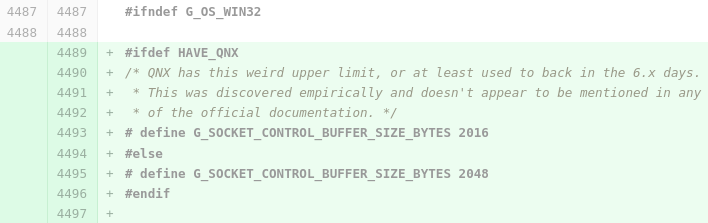

# Habr

Предыдущая обзорная [статья](https://habr.com/ru/post/99885/) на хабре об этом языке была в 2011. Язык с тех пор окреп, обзавелся инструментарием, и я думаю самое время написать о нем подробнее.

Это моя первая статья на хабре и в ней я попытаюсь разобрать Vala максимально подробно, можно даже считать это гайдом т.к. Vala не особо выделяется синтаксисом от других Си подобных языков.

Чего в языке нет:

* Мета-программирования
* Ad-hoc полиморфизма
* Compile Time Function Evaluation
* Runtime GC
* UB

А теперь о том что в языке есть:

... Спустя 40 минут после начала написания статьи я понял что статей будет несколько, конкретно эта будет обзорной, а вот полный список:

* Основы &lt;- вы здесь
* Системы типов
* Управление памятью
* C Interop
* Библиотекb GLib
* Библиотека GObject
* Библиотека GIO
* Библиотека Gee
* Библиотека GTK
* ...

Остальные статьи будут маленькими.

### Hello World

```text
namespace Example
{
    class Program
    {
        static void main()
        {
            stdout.printf("Hello World!"); // Вывод заданного текста в консоль
            stdin.read_line(); // Ожидание нажатия клавиши пользователем
        }
    }
}
```

```text
void main(){
    stdout.printf("Hello world");
}
```

```text
print("Hello World");
```

```text
init
    print "Hello World!"
```

В последнем примере используется альтернативный синтаксис, похожий на Python.

### Компилятор

Vala является [транспайлером](https://ru.wikipedia.org/wiki/%D0%A2%D1%80%D0%B0%D0%BD%D1%81%D0%BF%D0%B0%D0%B9%D0%BB%D0%B5%D1%80) в C, поэтому флаги соответствующие.

Запуск: `vala filename`

Компиляция: `valac filename`

Компиляция в C: `valac -C filename`

Вместе с .h файлом: `valac filename -C -H hello.h`

Пробросить флаг `O3` в C компилятор: `valac filename -X -O3`

Скомпилировать используя только libc\(многие фичи будут недоступны\): `valac filename --profile=posix`

Скомпилировать с помощью вашего C компилятора: `valac filename --cc=tcc`

## Синтаксис

Синтаксис Vala будет очень хорошо знаком всем кто когда-нибудь видел любой C-подобный язык.  
Я не просто так привел первым примером копию hello world из C\#. Языки крайне похожи, что может сильно упростить обучение, можно сказать вы уже знаете Vala и простенькие проги можно начать писать прочитав до этого места статьи.  
Знаю джависта который пришел в наше сообщество писать игровой движок в качестве хобби, по его словам он даже не заметил что пишет на другом языке.

### Naming

Стилистика нейминга однако отличается, могу придумать 2 причины:

1. Совместимость с C где чаще используется snake\_case
2. Использование различных \*case для улучшения читабельности

C\#

* classes, structs, delegate types: **CamelCase**
* methods, properties, events: **CamelCase**
* local variables, fields: **mixedCamelCase**
* constants, enum values: **CamelCase**

Java

* classes, interfaces, enums: **CamelCase**
* methods, local variables, fields: **mixedCamelCase**
* constants, enum values: **UPPER\_CASE**

Vala

* classes, structs, delegate types: **CamelCase**
* methods, properties, signals: **lower\_case**
* local variables, fields: **lower\_case**
* constants, enum values: **UPPER\_CASE**

### Управляющие конструкции

Основные управляющие структуры для протокола:

```text
while (a > b) { a--; }
do { a--; } while (a > b);
for (int a = 0; a < 10; a++) { stdout.printf("%d\n", a); }
foreach (int a in int_array) { stdout.printf("%d\n", a); }

if (a > 0) { stdout.printf("a is greater than 0\n"); }
else if (a < 0) { stdout.printf("a is less than 0\n"); }
else { stdout.printf("a is equal to 0\n"); }

switch (a) {
    case 1:
        stdout.printf("one\n");
        break;
    case 2:
    case 3:
        stdout.printf("two or three\n");
        break;
    default:
        stdout.printf("unknown\n");
    break;
}
```

Switch работает со строками и проверяет наличие break.


Замечание для C-программистов: условия всегда должны возвращать логическое значение. Это значит, что если вы хотите проверить переменную на равенство `null` или нулю, вы должны сделать это явно: `if (object != null) { }` или `if (number != 0) { }`.

### With

; в Smalltalk

.. в Ruby

with в visual basic


### Операторы

Арифметика: `+, -, /, *, %,  +=, -=, /=, *=, %=, ++, --`

Битовые операторы: или, исключающее или, и, не. Второе множество включает присвоение и аналогичные арифметические версии. Они могут быть применены к любому простому значению типов. \(Нет оператора присвоение для ~, так как это унарный оператор. Эквивалентом является `a=~a`\): `|, ^, &, ~, |=, &=, ^=`  
Побитовые сдвиги: `<<, >>, <<=, >>=`

Логические: `==, <, >, >=, <=, !=,   !, &&, ||`

Тернарный: `? :`

Null оператор: `a ?? b` эквивалентно a != null ? a : b   
Этот оператор особенно полезен, например, для предоставление дефолтного в том случае, если ссылка равна _null_:

```text
print("Hello, %s!\n", name ?? "unknown person");
```


in, ??, 


## Типы

Не вижу особого смысла перечислять базовые типы, но вроде как сложилась традиция.

Struct: bool, char, double, float, int, int16, int32, int64, int8, intptr, long, short, size\_t, ssize\_t, time\_t , uchar, uint, uint16, uint32, uint64, uint8, uintptr, ulong, unichar, unichar2, ushort, va\_list

Class:

* string — cstring\(UTF-8\)
* string16 — UTF-16
* string32 — Тип, который может содержать любой UTF-32 или UCS-4 символ, также известнен как Unicode code point

Стандартный тип string является cstring для совместимости, для активной конкатенации есть тип StringBuilder.

В Vala используется строгая статическая типизация.

Присутствуют Value, Reference типы и Pure указатели для ручного контроля. 

Планируется добавить  .?


### Структуры

Здесь будет объяснение почему в предыдущем разделе были использованы слова Struct и Class вместо Value type, Reference Type

Дело в том что все типы в vala это биндинги к типам GLib. Это не значит что используя int мы имеем какой то overhead:


В vala очень продвинутая система биндингов к C коду, можно сказать vala на половину из нее состоит. 


Тогда откуда тогда у взялись int методы?


Вот отсюда:

```text
//glib-2.0.vapi
[SimpleType]
[GIR (name = "gint")]
[CCode (cname = "gint", cheader_filename = "glib.h", type_id = "G_TYPE_INT", marshaller_type_name = "INT", get_value_function = "g_value_get_int", set_value_function = "g_value_set_int", default_value = "0", default_value_on_error = "-1", type_signature = "i")]
[IntegerType (rank = 6)]
public struct int {
	[CCode (cname = "G_MININT")]
	public const int MIN;
	[CCode (cname = "G_MAXINT")]
	public const int MAX;

	[CCode (cname = "g_strdup_printf", instance_pos = -1)]
	public string to_string (string format = "%i");

	[CCode (cname = "MIN")]
	public static int min (int a, int b);
	[CCode (cname = "MAX")]
	public static int max (int a, int b);
	[CCode (cname = "CLAMP")]
	public int clamp (int low, int high);

	[CCode (cname = "GINT_TO_POINTER")]
	public void* to_pointer ();
	[CCode (cname = "GPOINTER_TO_INT")]
	public static int from_pointer (void* p);

	[CCode (cname = "abs", cheader_filename = "stdlib.h")]
	public int abs ();

	[CCode (cname = "GINT_TO_BE")]
	public int to_big_endian ();
	[CCode (cname = "GINT_TO_LE")]
	public int to_little_endian ();

	[CCode (cname = "GINT_FROM_BE")]
	public static int from_big_endian (int val);
	[CCode (cname = "GINT_FROM_LE")]
	public static int from_little_endian (int val);

	[CCode (cname = "atoi", cheader_filename = "stdlib.h")]
	public static int parse (string str);

	[CCode (cname = "strtol", cheader_filename = "stdlib.h")]
	static long strtol (string nptr, out char* endptr, int _base);

	public static bool try_parse (string str, out int result = null, out unowned string unparsed = null, uint _base = 0) {
		char* endptr;
		errno = 0;
		long long_result = strtol (str, out endptr, (int) _base);
		if (endptr == (char*) str + str.length) {
			unparsed = "";
		} else {
			unparsed = (string) endptr;
		}
		if (int.MIN <= long_result <= int.MAX) {
			result = (int) long_result;
			return errno != ERANGE && errno != EINVAL && unparsed != endptr;
		} else {
			result = int.MAX;
			return false;
		}
	}
}
```

Все верно, даже базовые value типы на самом деле являются биндингами к типам GLib. То что тип содержит внутри себя функции это иллюзия из-за того что при биндинге их туда положили. Также здесь видно что некоторые функции отсутствующие в GLib пишут на месте\(`try_parse`\).


--------------


СПОЙЛЕР

На самом деле никаких строенных конкретно в Vala типов нет, хотя их можно так назвать. Все типы это биндинги к GLib, по сути в Vala нет ничего кроме высокоуровневых биндингов к GLib, подробнее об этом я расскажу позже, но вот пример того как внутри выглядит начало типа int для затравки:

```text
[SimpleType]
[GIR (name = "gint")]
[CCode (cname = "gint", cheader_filename = "glib.h", type_id = "G_TYPE_INT", marshaller_type_name = "INT", get_value_function = "g_value_get_int", set_value_function = "g_value_set_int", default_value = "0", default_value_on_error = "-1", type_signature = "i")]
[IntegerType (rank = 6)]
public struct int {
	[CCode (cname = "G_MININT")]
	public const int MIN;
	[CCode (cname = "G_MAXINT")]
	public const int MAX;

	[CCode (cname = "g_strdup_printf", instance_pos = -1)]
	public string to_string (string format = "%i");

	[CCode (cname = "MIN")]
	public static int min (int a, int b);
	[CCode (cname = "MAX")]
	public static int max (int a, int b);
	[CCode (cname = "CLAMP")]
	public int clamp (int low, int high);

	[CCode (cname = "GINT_TO_POINTER")]
	public void* to_pointer ();
	[CCode (cname = "GPOINTER_TO_INT")]
	public static int from_pointer (void* p);
  ...
```

Вот список некоторых типов из GLib просто чтобы пробежаться глазами, самые скучные я удалил.

GLib structs: [Cond](https://valadoc.org/glib-2.0/GLib.Cond.html), [Datalist](https://valadoc.org/glib-2.0/GLib.Datalist.html), [Date](https://valadoc.org/glib-2.0/GLib.Date.html), [DebugKey](https://valadoc.org/glib-2.0/GLib.DebugKey.html), [HashTableIter](https://valadoc.org/glib-2.0/GLib.HashTableIter.html), [LogField](https://valadoc.org/glib-2.0/GLib.LogField.html), [MarkupParser](https://valadoc.org/glib-2.0/GLib.MarkupParser.html), [Mutex](https://valadoc.org/glib-2.0/GLib.Mutex.html), [Once](https://valadoc.org/glib-2.0/GLib.Once.html), [OptionEntry](https://valadoc.org/glib-2.0/GLib.OptionEntry.html), [Pid](https://valadoc.org/glib-2.0/GLib.Pid.html), [PollFD](https://valadoc.org/glib-2.0/GLib.PollFD.html), [Quark](https://valadoc.org/glib-2.0/GLib.Quark.html), [RWLock](https://valadoc.org/glib-2.0/GLib.RWLock.html), [RecMutex](https://valadoc.org/glib-2.0/GLib.RecMutex.html), [ScannerConfig](https://valadoc.org/glib-2.0/GLib.ScannerConfig.html), [SourceFuncs](https://valadoc.org/glib-2.0/GLib.SourceFuncs.html), [Time](https://valadoc.org/glib-2.0/GLib.Time.html), [TimeSpan](https://valadoc.org/glib-2.0/GLib.TimeSpan.html), [TokenValue](https://valadoc.org/glib-2.0/GLib.TokenValue.html), [UTimBuf](https://valadoc.org/glib-2.0/GLib.UTimBuf.html), [UriParamsIter](https://valadoc.org/glib-2.0/GLib.UriParamsIter.html), [pointer](https://valadoc.org/glib-2.0/GLib.pointer.html).

GLib classes: [AsyncQueue](https://valadoc.org/glib-2.0/GLib.AsyncQueue.html), [BookmarkFile](https://valadoc.org/glib-2.0/GLib.BookmarkFile.html), [ByteArray](https://valadoc.org/glib-2.0/GLib.ByteArray.html), [Bytes](https://valadoc.org/glib-2.0/GLib.Bytes.html), [Checksum](https://valadoc.org/glib-2.0/GLib.Checksum.html), [DateTime](https://valadoc.org/glib-2.0/GLib.DateTime.html), [Dir](https://valadoc.org/glib-2.0/GLib.Dir.html), [Error](https://valadoc.org/glib-2.0/GLib.Error.html), [FileStream](https://valadoc.org/glib-2.0/GLib.FileStream.html), [Rand](https://valadoc.org/glib-2.0/GLib.Rand.html), [RecMutexLocker](https://valadoc.org/glib-2.0/GLib.RecMutexLocker.html), [Regex](https://valadoc.org/glib-2.0/GLib.Regex.html), \(Lexical\) [Scanner](https://valadoc.org/glib-2.0/GLib.Scanner.html), [StringBuilder](https://valadoc.org/glib-2.0/GLib.StringBuilder.html), [TestCase](https://valadoc.org/glib-2.0/GLib.TestCase.html), [Thread](https://valadoc.org/glib-2.0/GLib.Thread.html), [ThreadPool](https://valadoc.org/glib-2.0/GLib.ThreadPool.html), [TimeZone](https://valadoc.org/glib-2.0/GLib.TimeZone.html), [Timer](https://valadoc.org/glib-2.0/GLib.Timer.html), [Uri](https://valadoc.org/glib-2.0/GLib.Uri.html), [Variant](https://valadoc.org/glib-2.0/GLib.Variant.html).

### Классы

#### Class


#### Compact

Про Slice аллокатор

#### GObject


### Функции


### Nullability

## GIR


## Управление памятью

ARC

Compact класс с ARC

Compact класс с копированием

Примеры передачи владения

## Фичи

## Установка

### Linux

Arch: `yay -S vala`

Fedora: `sudo dnf install vala`

CentOS: `sudo yum install vala`

Debian: `sudo apt install valac`

Для старых deb подобных дистрибутивов есть [vala-next](https://launchpad.net/~vala-team/+archive/ubuntu/next) репа где публикуются последние версии.

### Windows

MSYS2:

```text
pacman -S mingw-w64-x86_64-gcc 
pacman -S mingw-w64-x86_64-pkg-config
pacman -S mingw-w64-x86_64-vala
```

### Mac

`brew install vala`

### Android 

Termux: `pkg install vala`

### \*BSD

```text
cd /usr/ports/lang/vala/ && make install clean
pkg install vala
```

## Инструменты


## Компании которые используют


## Genie


## Популярные мифы о непопулярном языке

* Vala каким либо образом зависит от GTK

Нет, только от GLib, о ней будет отдельная статья, вкратце GLib полностью кроссплатформенна, её можно найти в Qt, Android, Windows \(dll на Windows весит 2 МБ\) и даже на QNX:



Также можно генерировать код без зависимостей,  тогда не будет классов, зато есть vapi для posix


Есть PR на добавление compact классов. 

### Статья 2 Типизации Vala

В Vala используется строгая статическая типизация.

Присутствуют Value и Reference типы

```text

```

Но также есть возможность использовать pure указатели

```text

```

### История появления

  
базовые типы данных, строки, массивы, срезы  
nullability

Функции, делегаты, ref, out, проверки на нулл, ООП  
ARC, owned unowned  
дженерики, наследование от дженериков

С интероп, Vapi, фичи при си интеропе вроде noReturn  
GIR интероп\(тут рассказать про GObject\)

Кодогенерация  
with, regexp, async, \[Flag\] enum, Variable\(с toJsonом\),

